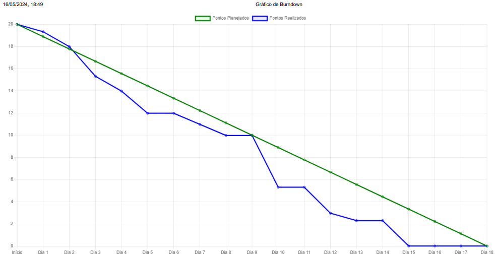

# INNOVATECH LABS

  

---

👋 **Olá! Seja bem-vindo ao repositório oficial da Innovatech. Aqui você acompanha todo o processo de desenvolvimento do projeto da ABP do primeiro semestre de DSM.**

### Introdução
Somos a Innovatech Labs, um grupo de desenvolvimento de software focado em criar soluções inovadoras. Este repositório apresenta o nosso mais recente projeto: uma plataforma de cursos online desenvolvida com tecnologias modernas da web.

### Visão Geral do Projeto
Nosso site para cursos oferece uma experiência de aprendizado rica e interativa. A plataforma foi projetada para ser intuitiva e acessível, permitindo que instrutores criem e gerenciem cursos, enquanto os alunos podem acessar conteúdos de qualidade em qualquer lugar e a qualquer momento.

### Time
- **Scrum Master:** Luana Pinheiro
- **Product Owner:** Pedro Oliveira
- **Desenvolvedor:** Gabriel Juliani
- **Desenvolvedor:** Igor Paulino
- **Desenvolvedor:** Bruno Alves
- **Desenvolvedor:** Bruno Henrique
- **Desenvolvedor:** Valcir Junior

### Tecnologias Utilizadas
- **Prototipagem:** [Figma](https://www.figma.com/file/3XwwS8l4t1NWeAINtgRX2n/Untitled?type=design&node-id=0%3A1&mode=design&t=k4hpImu9r1hWivGf-1)
- **Frontend:** HTML, CSS, JavaScript
- **Backend:** Node.js, Express
- **Banco de Dados:** Postgres
- **Hospedagem:** Render
- **Controle de Versão:** GitHub

### Funcionalidades
- **Registro e Login de Usuários:** Sistema seguro de autenticação.
- **Catálogo de Cursos:** Navegação e busca por diversos cursos.
- **Interatividade:** Avaliação e vídeos.
- **Histórico e Certificação:** Registro da avaliação aprovada, porcentagem de aproveitamento e emissão de certificado.

### Estrutura do Código
- **Frontend:** Todo o código fonte do frontend está localizado na pasta `/client`.
- **Backend:** O código fonte do backend está na pasta `/server`.
- **Banco de Dados:** A documentação completa do banco de dados, incluindo esquemas, tabelas e consultas SQL, pode ser encontrada na pasta  [`/postgresdb`](https://github.com/gjulianni/Innovatech/tree/main/postgresdb).
- **Documentação:** A documentação completa da API e guias de instalação estão na pasta [`/documentation`](https://github.com/gjulianni/Innovatech/tree/main/documentation).

---
## Backlog do Projeto

- **Ferramenta de Gestão de Backlog:** [Backlog](https://github.com/orgs/InovatechLabs/projects/2)

**Requisitos:**

- User Stories
- Arquitetura Funcional
- Elaboração e Criação do Reposirório
- Especificação - Identidade Visual
- Especificação - Arquitetura de Informação
- Especificação - Página de Login
- Especificação - Página de Cadastro Inicial
- Especificação - Modelagem do DB
- Protótipos das Telas
- Especificação - Cadastro de Questões
- Modelagem do BD
- Especificação - Página de Questões
- Especificação - Certificado de Conclusão
- Especificação - Gerenciamento de Questões
- Desenvolver Banco de Dados
- Front End - Página de Login
- Front End - Página de Cadastro
- Front End - Página Inicial
- Front End - Menu
- Back End - Página de Login
- Back End - Página de Cadastro
- Back End - Página Inicial
- Back End - Menu
- Front End - Página Avaliação
- Back End - Página de Avaliação
- Front End - Páginas de Conteúdos
- Back End - Páginas de Conteúdos
- Front End - Página de Certificação
- Back End - Página de Certificação
- Gerenciamento Questões
- Hospedagem Máquina Virtual

---

## Gestão de Demanda

- **Ferramenta de Gestão de Atividades:** [Trello](https://trello.com/b/Zq9DXif1/abp-s1-plataforma-scrum)

- **Entregas da Primeira Sprint:**

| Requisitos        | Status                         |
|---------------------|---------------------------------|
| User Stories    | **✅ Concluído**         |
| Arquitetura Funcional    | **✅ Concluído**        |
| Elaboração e Criação do Reposirório  | **✅ Concluído**         |
| Especificação - Identidade Visual | **✅ Concluído**        |
| Especificação - Arquitetura de Informação | **✅ Concluído**        |
| Especificação - Página de Login | **✅ Concluído**        |
| Especificação - Página de Cadastro Inicial | **✅ Concluído**        |
| Especificação - Modelagem do DB | **✅ Concluído**        |
| Protótipos das Telas | **✅ Concluído**        |
| Especificação - Cadastro de Questões | **✅ Concluído**        |
| Modelagem do BD | **✅ Concluído**        |
| Especificação - Página de Questões | **✅ Concluído**        |
| Especificação - Certificado de Conclusão | **✅ Concluído**        |
| Especificação - Gerenciamento de Questões | **✅ Concluído**        |

- **Entregas da Segunda Sprint:**

| Requisitos        | Status                         |
|---------------------|---------------------------------|
| Desenvolver Banco de Dados    | **✅ Concluído**         |
| Front End - Página de Login    | **✅ Concluído**        |
| Front End - Página de Cadastro  | **✅ Concluído**         |
| Front End - Página Inicial | **✅ Concluído**        |
| Front End - Menu | **✅ Concluído**        |
| Back End - Página de Login | **✅ Concluído**        |
| Back End - Página de Cadastro | **✅ Concluído**        |
| Back End - Página Inicial | **✅ Concluído**        |
| Back End - Menu | **✅ Concluído**        |

- **Entregas da Terceira Sprint:**

| Requisitos        | Status                         |
|---------------------|---------------------------------|
| Front End - Página Avaliação    | **✅ Concluído**         |
| Back End - Página de Avaliação    | **✅ Concluído**        |
| Front End - Páginas de Conteúdos  | **✅ Concluído**         |
| Back End - Páginas de Conteúdos | **✅ Concluído**        |
| Front End - Página de Certificação | **✅ Concluído**        |
| Back End - Página de Certificação | **✅ Concluído**        |
| BD - Gerenciamento Questões | **✅ Concluído**        |
| Hospedagem Máquina Virtual | **🔄 Em Progresso**    |

---
## Indicadores:

- Burndown Primeira Sprint:

  

- Burndown Segunda Sprint:

  

- Burndown Terceira Sprint:

  

